# Donesi.me

> A bilingual food-delivery web application for Podgorica, Montenegro — Next.js storefront, Express + Prisma REST API, PostgreSQL.

[](https://github.com/DaniloK77/Donesi.me/actions/workflows/ci.yml)
[](https://nextjs.org)
[](https://nodejs.org)
[](https://www.prisma.io)
[](https://www.postgresql.org)
[](LICENSE)

## Overview

Donesi.me lets customers in Podgorica browse local restaurants on a map, build a cart with
per-item customisation, pin a delivery address inside the covered zone, and place and track an
order. The whole interface ships in two locales — Montenegrin (`me`, the default) and English
(`en`) — served from JSON dictionaries rather than a translation runtime.

Behind the storefront sits a role-guarded admin panel: it accepts orders, generates the delivery
promise, assigns couriers, edits restaurant menus and manages users — and the customer watches the
courier move toward their address on a live map.

It is a portfolio project built end to end: a Next.js 16 App Router frontend, an Express 5 REST
API with cookie-based sessions and Argon2id password hashing, and a PostgreSQL database modelled
and migrated with Prisma.

## Screenshots

### Storefront

The homepage opens on the delivery promise the product actually keeps — the three status cards
mirror the real order lifecycle a customer will see later on the tracking page.


Weekly discounts are computed server-side from `weeklyDiscountPercent`, so the crossed-out price
and the discounted one can never drift apart, and category tabs filter without a round trip.

| Deals and categories | Weekly discount schedule |
| --- | --- |
| 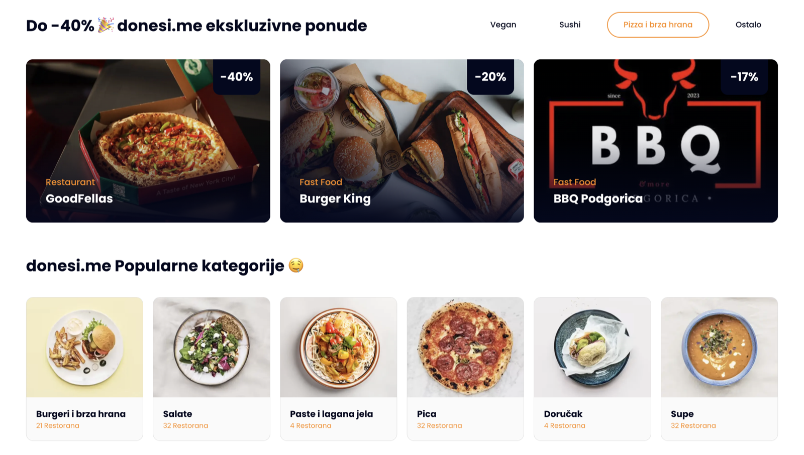 | 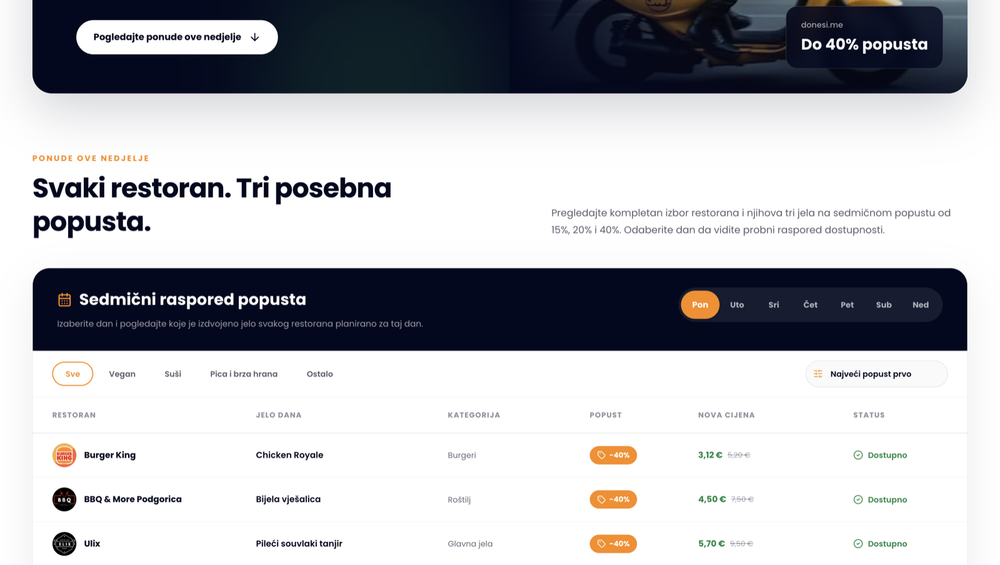 |

| Referral section | Featured restaurants |
| --- | --- |
|  | 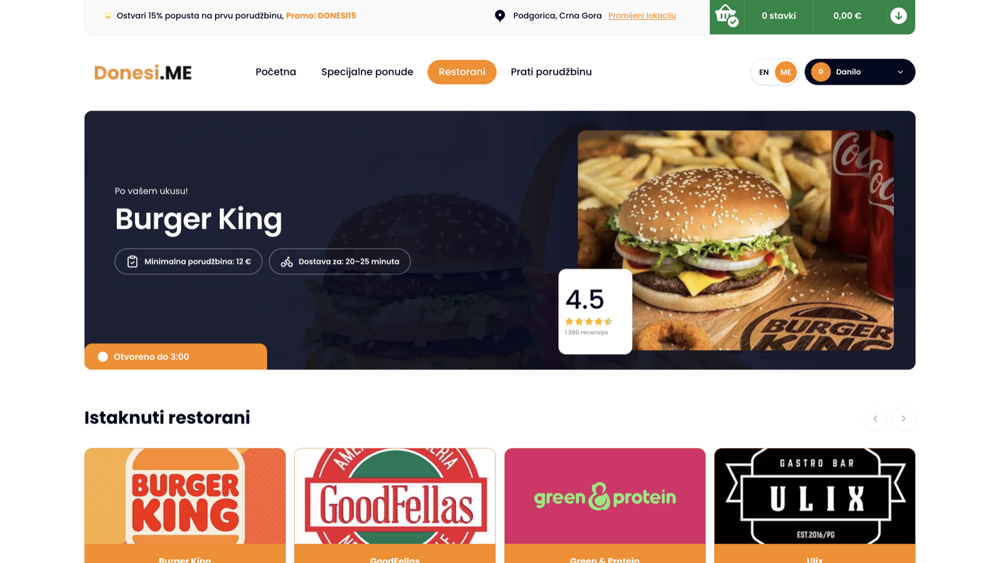 |

### Discovery

Restaurants can be searched by name or cuisine, filtered by category and sorted by rating or
delivery time. The map is MapLibre GL over a CARTO raster style, locked to a Podgorica bounding
box, with each pin opening the restaurant it belongs to.

| Restaurant listing | Map of restaurants |
| --- | --- |
| 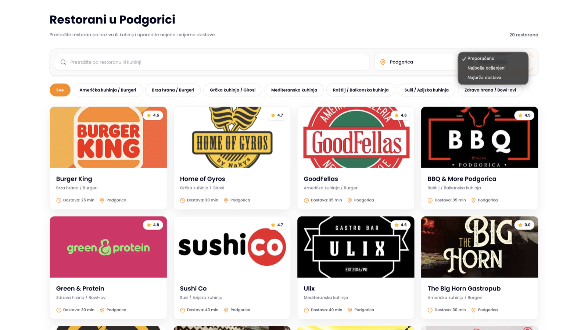 | 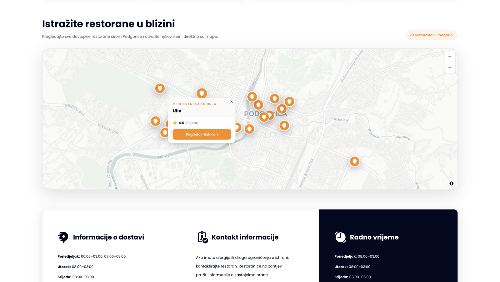 |

### Menu and item customisation

Customisation groups are derived server-side from the restaurant's profile — a grill house offers
different add-ons than a sushi bar — and the three-step modal carries the running total, a cutlery
question that defaults to "no" to cut waste, and a 200-character note for allergies.

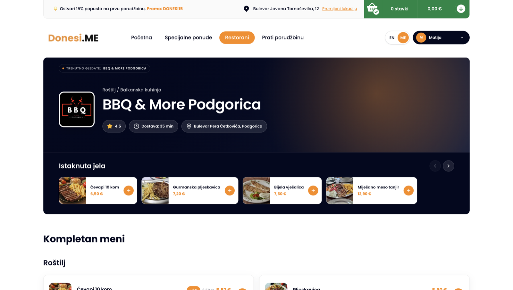

| 1 · Add-ons | 2 · Cutlery | 3 · Special requests |
| --- | --- | --- |
| 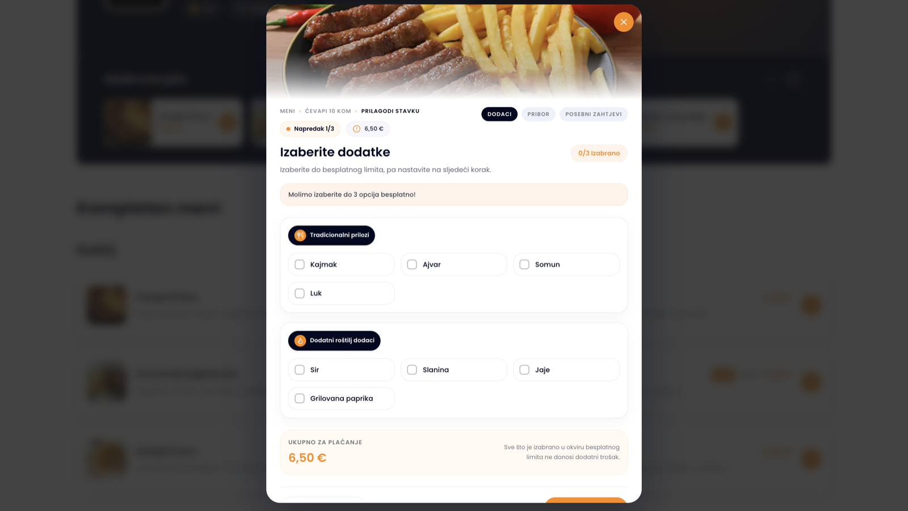 | 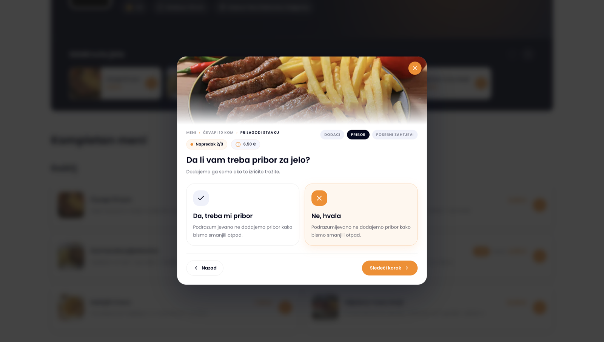 | 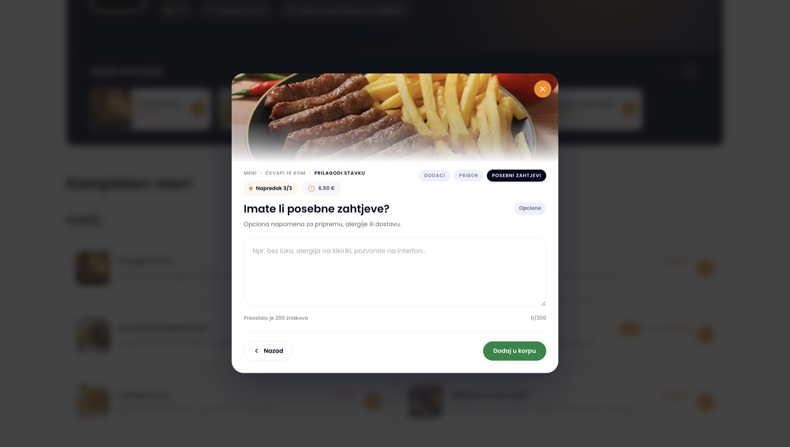 |

### Cart and delivery address

The cart keeps every customisation visible on the line item, states plainly that cash on delivery
is the only method, shows the exact amount to prepare, and spells out the five-minute cancellation
window *before* the order is placed. The address is either typed against a seeded list of Podgorica
streets or pinned on the map, and is validated against the served zone.

| Cart with customisations | Delivery address | Pin on the map |
| --- | --- | --- |
| 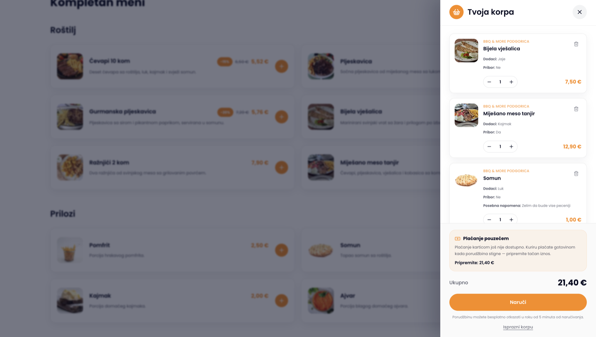 |  | 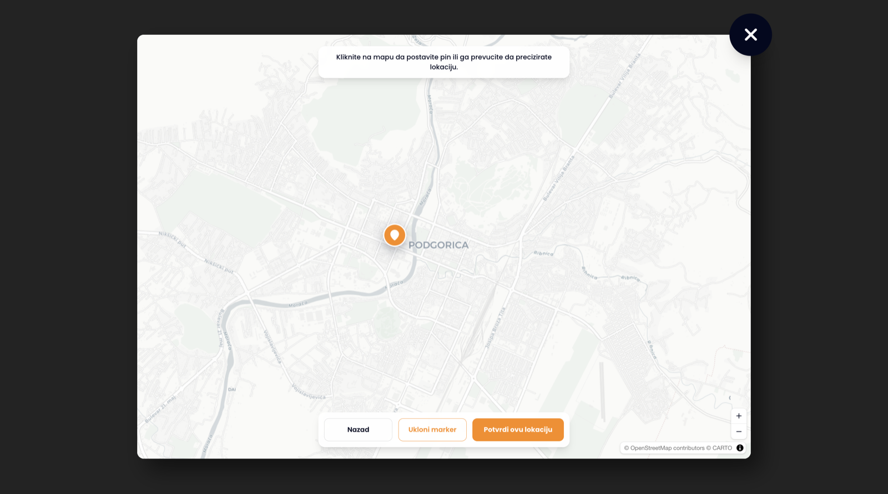 |

### Order tracking

The tracking page refreshes itself every 10 seconds, so an acceptance in the admin panel appears
without a reload. Once accepted it counts down to the generated delivery estimate, and inside the
first five minutes it offers a cancel button with the remaining window ticking down.

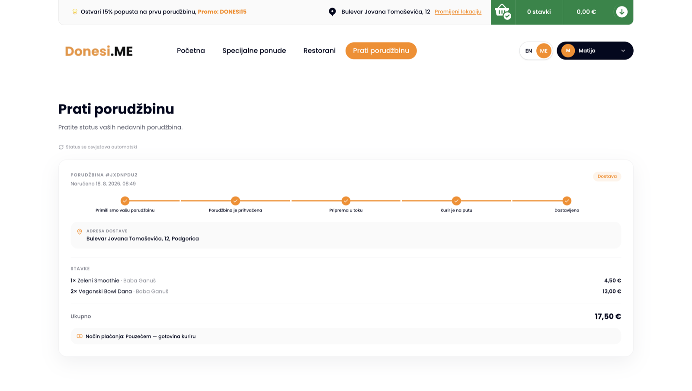

### Admin panel

`/[lang]/admin` is guarded by `requireRole("ADMIN")` on every endpoint, and only advertised in the
user menu to administrators. From here an order is accepted, pushed through its lifecycle and
handed to a courier — the panel picks a free active one automatically if none is assigned.

The screenshot below shows the piece worth calling out: **the courier delivery simulation.** There
is no GPS feed behind this project, so the courier marker is animated along a route derived
deterministically from the order id — the same order always draws the same path. Marker **A** is
the restaurant, **B** the delivery address, the orange line is the remaining leg, and the ETA,
distance left and progress bar update as the courier advances. The admin can start it for any
order, and it is the exact same component the customer sees on their tracking page, so the two
views can never disagree.

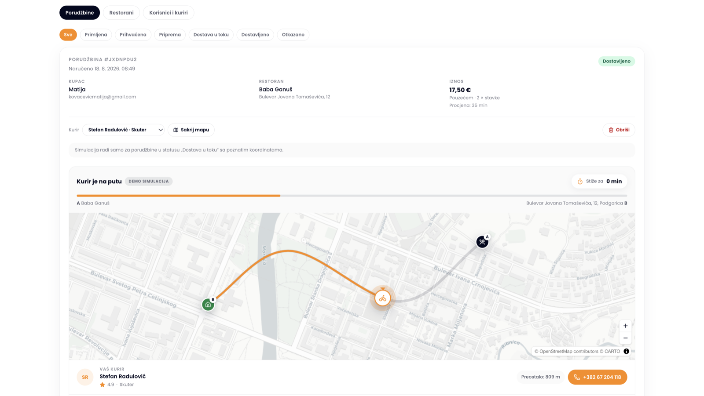

The panel also edits a restaurant's whole menu — categories and items, availability toggles, and
item images either uploaded as a file or pasted as a link. The preview underneath renders the card
exactly as the customer will see it on the restaurant page, so there is no need to leave the panel
to check the result.

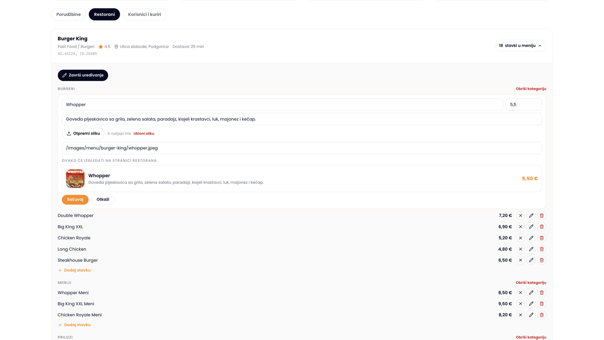

Users and couriers are managed from the same place, with the guards that matter: an administrator
cannot delete their own account, the last administrator cannot be removed, and a courier holding an
order in transit is refused with an explanation rather than a generic error.

## Tech Stack

| Layer          | Technology                                                                                     |
| -------------- | ---------------------------------------------------------------------------------------------- |
| **Frontend**   | Next.js 16 (App Router, Turbopack), React 19, TypeScript 5, Tailwind CSS 4, shadcn/ui + Base UI, MapLibre GL, lucide-react, Poppins via Fontsource |
| **Backend**    | Node.js, Express 5, `cors`, `cookie-parser`, `express-rate-limit`, `multer` (image uploads), `dotenv`, nodemon |
| **Database**   | PostgreSQL, Prisma ORM 6 (16 committed migrations + idempotent seed)                            |
| **Auth**       | Opaque session cookie (`httpOnly`, `sameSite=lax`, `secure` in production), SHA-256 token hashes at rest, Argon2id password hashing, role-based guards |
| **Validation** | Zod 4 schemas for auth, profile, address, order and admin payloads                              |
| **Tooling**    | ESLint 9 (`eslint-config-next`), GitHub Actions CI, npm (backend) / Yarn (frontend)             |

## Architecture

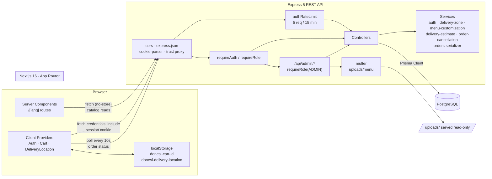

### Authentication flow

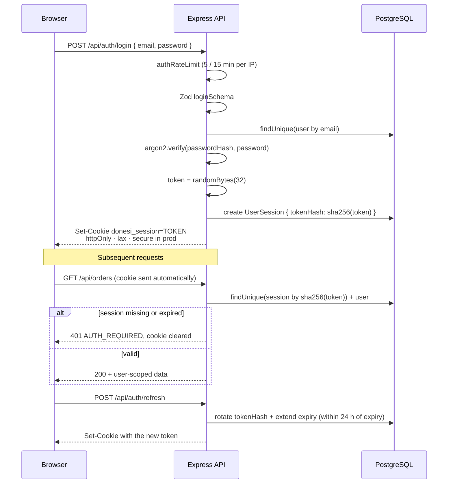

The raw session token is never stored — only its SHA-256 hash — so a database leak alone cannot
be replayed against the API.

## Features

**Catalog & discovery**

- Restaurant listing with logos, ratings, delivery times and per-city category metadata
- Restaurant detail pages by slug with ordered menu categories, featured-item carousel and reviews
- MapLibre GL map of Podgorica restaurants, constrained to a city bounding box and a CARTO raster style
- Homepage sections: hero, deal tabs (`VEGAN` / `SUSHI` / `PIZZA_FASTFOOD` / `OTHER`), food categories, popular restaurants, app promo, partner & rider CTAs, FAQ/about tabs, stats and footer
- Weekly discounts: menu items carrying a `weeklyDiscountPercent`, grouped by restaurant with the discounted price computed server-side

**Cart & customisation**

- Server-persisted cart usable without an account — the cart id lives in `localStorage`
- Add, update quantity, remove and clear items, with a 99-per-item cap and a live subtotal
- Per-item customisation derived server-side from restaurant profiles (pizza, sushi, fast food, gyros, grill, healthy, mediterranean, breakfast), covering add-on groups with extra pricing, a cutlery toggle and a free-text special request
- Unavailable menu items are rejected at add time and again at checkout

**Delivery zone**

- Delivery-location popup with autocomplete over a seeded list of Podgorica streets
- Diacritic-insensitive street search (`Njegoševa` matches `njegoseva`)
- Bounding-box check that confirms whether a pinned coordinate falls inside the served area
- Chosen location persists in `localStorage` and syncs to the signed-in user's saved addresses

**Accounts**

- Register, log in, log out and session refresh with rotation near expiry
- Rate limiting on register, login and forgot-password
- Profile management: update name and phone, change password, delete account
- Saved delivery addresses with full CRUD and a single enforced default
- `UserRole` enum (`CUSTOMER`, `ADMIN`, `RESTAURANT_OWNER`, `COURIER`); `requireRole` guards the whole admin API, and the panel is only advertised in the user menu to administrators

**Orders & payment**

- Checkout converts a cart into an order in one transaction, snapshotting item name, unit price and restaurant so later menu edits cannot rewrite order history
- `DELIVERY` and `PICKUP` types; delivery orders resolve the chosen or default address
- Cash on delivery is the only payment method, and the interface says so before the order is placed, on the order itself and on the tracking page — modelled as a `PaymentMethod` enum so adding card payments later is additive
- Order list and order detail, both scoped to the authenticated user
- `OrderStatus` lifecycle (`PENDING` → `CONFIRMED` → `PREPARING` → `OUT_FOR_DELIVERY` → `DELIVERED` / `CANCELLED`), advanced from the admin panel
- **Delivery estimate** generated at the moment the order is accepted — restaurant prep time plus travel distance to the address, rounded to a five-minute step and clamped to 15–90 minutes. Stored once, so a later status change cannot move the promise
- **Customer cancellation inside a five-minute window**, enforced server-side: only the owner, only before the courier collects the food. The API publishes `canCancel` and the window expiry, so the button and the rule can never disagree

**Order tracking**

- Tracking page refreshes itself every 10 seconds, pauses while the tab is hidden and refetches the moment the customer returns to it — an acceptance in the admin panel shows up without a reload
- Live countdown to the promised delivery time, and a cancel button that counts its remaining window down to the second
- Step four of the tracker opens a **MapLibre map**: marker A at the restaurant, marker B at the delivery address, and an animated courier marker travelling a deterministic curved route between them
- Route geometry is derived from the order id, so the same order always draws the same path; ETA, remaining distance and progress update as the courier advances
- Playback controls (pause, replay, 1× / 6× / 12×) for demonstrating the flow, clearly labelled as a simulation

**Admin panel** — `/[lang]/admin`, `ADMIN` role only

- Dashboard counters, and orders from every restaurant with status filters
- Accept or reject an order, push it through the lifecycle, mark it delivered, or delete a test order
- Assign a courier by hand, or let the panel pick a free active one automatically when an order goes out for delivery
- Run the courier map simulation for any order, reusing the exact component the customer sees
- Full menu editing per restaurant: add, rename and delete categories; add, edit, delete items; toggle availability
- **Menu images by file upload or link**, with a live preview of the card as it will appear on the restaurant page
- Users and couriers: delete an account, delete or deactivate a courier — guarded so an administrator cannot delete their own account, the last administrator cannot be removed, and a courier holding an order in transit is refused

**Responsive**

- Verified down to 360 px on every route, with horizontal overflow measured programmatically rather than eyeballed
- Long or secondary copy is dropped below the `sm` breakpoint instead of crowding small screens

**Internationalisation**

- `me` and `en` locales under `/[lang]`, statically generated with `dynamicParams = false`; `/` redirects to `/me`
- Per-page JSON dictionaries, typed and loaded server-side

> Not yet implemented: password reset and email verification return `501`, and forgot-password
> responds `202` without sending mail. There is no restaurant-facing dashboard yet — restaurants do
> not accept their own orders; an administrator does it for them. Courier movement on the map is a
> client-side simulation, not a GPS feed.

## Getting Started

### Prerequisites

- Node.js 22 (or 20+)
- npm (backend) and Yarn 1.x (frontend)
- A PostgreSQL 14+ database

### 1. Clone

```bash
git clone https://github.com/DaniloK77/Donesi.me.git
```

```bash
cd Donesi.me
```

### 2. Backend

```bash
cd backend
```

```bash
cp .env.example .env
```

Edit `.env` and point `DATABASE_URL` at your PostgreSQL instance. `PORT` defaults to `5001` and
`FRONTEND_URL` must match the frontend origin exactly — CORS runs with `credentials: true`, which
forbids a wildcard.

`PUBLIC_API_URL` is optional locally: it is the public origin used to build URLs for uploaded
images. Leave it unset and the request host is used instead; set it when the API sits behind a
proxy or tunnel, or uploaded images will point at an internal host.

```bash
npm install
```

Apply the committed migrations and load the development dataset (seed is idempotent — restaurants,
menus, Podgorica streets, deals, categories and reviews):

```bash
npx prisma migrate deploy
```

```bash
npm run db:seed
```

The seed also creates an administrator (`admin@donesi.me` / `admin1234` — change it before this
is anything but a demo) and a set of test couriers. To promote an account you already registered:

```bash
npm run user:role -- your.email@example.com
```

Roles are read from the database on every request, so the change takes effect on the next page
load — no need to sign out. Pass a second argument (`CUSTOMER`, `RESTAURANT_OWNER`, `COURIER`) to
set a different role.

Start the API on `http://localhost:5001`:

```bash
npm run dev
```

Use `npm run dev` rather than `npm start` while developing — `start` runs plain `node`, which does
not reload on file changes, so new routes silently 404 until you restart it by hand.

Check it is up:

```bash
curl http://localhost:5001/health
```

### 3. Frontend

From the repository root, in a second terminal:

```bash
cd frontend
```

```bash
cp .env.example .env.local
```

The default `NEXT_PUBLIC_API_URL=http://localhost:5001` matches the backend defaults, so no edit is
needed for local work.

```bash
yarn install
```

```bash
yarn dev
```

Open [http://localhost:3000](http://localhost:3000) — it redirects to `/me`.

### Useful scripts

| Location   | Command           | Description                                     |
| ---------- | ----------------- | ----------------------------------------------- |
| `backend`  | `npm run dev`     | Start the API with nodemon                      |
| `backend`  | `npm start`       | Start the API with plain node                   |
| `backend`  | `npm run db:seed` | Run the idempotent Prisma seed                  |
| `backend`  | `npm run db:seed:couriers` | Add the test couriers only — safe on a database with live carts, unlike the full seed |
| `backend`  | `npm run user:role -- <email> [ROLE]` | Grant a role, `ADMIN` by default |
| `frontend` | `yarn dev`        | Next.js dev server                              |
| `frontend` | `yarn build`      | Production build                                |
| `frontend` | `yarn start`      | Serve the production build                      |
| `frontend` | `yarn lint`       | ESLint                                          |

## API Reference

Base URL: `http://localhost:5001`. Authenticated routes read the `donesi_session` cookie, so
browser calls must use `credentials: "include"`.

### Health

| Method | Endpoint  | Description                | Auth |
| ------ | --------- | -------------------------- | ---- |
| `GET`  | `/health` | Liveness probe, `{ status }` | –  |

### Authentication — `/api/auth`

| Method | Endpoint                     | Description                                             | Auth |
| ------ | ---------------------------- | ------------------------------------------------------- | ---- |
| `POST` | `/api/auth/register`         | Create an account and open a session · rate limited      | –    |
| `POST` | `/api/auth/login`            | Authenticate and open a session · rate limited           | –    |
| `POST` | `/api/auth/logout`           | Destroy the session and clear the cookie                 | –    |
| `GET`  | `/api/auth/me`               | Current user                                             | ✅   |
| `POST` | `/api/auth/refresh`          | Rotate the session token when close to expiry            | ✅   |
| `POST` | `/api/auth/forgot-password`  | Placeholder — always `202`, no mail sent · rate limited  | –    |
| `POST` | `/api/auth/reset-password`   | Not implemented (`501`)                                  | –    |
| `POST` | `/api/auth/verify-email`     | Not implemented (`501`)                                  | –    |

### Users — `/api/users`

| Method   | Endpoint                 | Description                          | Auth |
| -------- | ------------------------ | ------------------------------------ | ---- |
| `PATCH`  | `/api/users/me`          | Update name and/or phone             | ✅   |
| `PATCH`  | `/api/users/me/password` | Change password (verifies the old one) | ✅ |
| `DELETE` | `/api/users/me`          | Delete the account and its data       | ✅   |

### Addresses — `/api/addresses`

| Method   | Endpoint              | Description                                  | Auth |
| -------- | --------------------- | -------------------------------------------- | ---- |
| `GET`    | `/api/addresses`      | List the user's addresses, default first     | ✅   |
| `POST`   | `/api/addresses`      | Create an address, optionally as the default | ✅   |
| `PATCH`  | `/api/addresses/:id`  | Update an address                             | ✅   |
| `DELETE` | `/api/addresses/:id`  | Delete an address                             | ✅   |

### Restaurants & catalog

| Method | Endpoint                     | Description                                                    | Auth |
| ------ | ---------------------------- | -------------------------------------------------------------- | ---- |
| `GET`  | `/api/restaurants`           | Restaurant summaries ordered by `displayOrder`                 | –    |
| `GET`  | `/api/restaurants/:slug`     | One restaurant with reviews, menu categories, items, featured items and customisation definitions | – |
| `GET`  | `/api/popular-restaurants`   | Top six restaurants for the homepage                            | –    |
| `GET`  | `/api/categories`            | Food categories in a fixed display order                        | –    |
| `GET`  | `/api/deals`                 | Promo deals · optional `?category=VEGAN\|SUSHI\|PIZZA_FASTFOOD\|OTHER` | – |
| `GET`  | `/api/deals/weekly`          | Discounted menu items grouped by restaurant                     | –    |
| `GET`  | `/api/streets`               | Podgorica streets · optional `?query=` diacritic-insensitive search | – |

### Delivery — `/api/delivery`

| Method | Endpoint                       | Description                                          | Auth |
| ------ | ------------------------------ | ---------------------------------------------------- | ---- |
| `POST` | `/api/delivery/check-location` | Validate an address and test coordinates against the Podgorica zone | – |

### Cart — `/api/cart`

Carts are addressed by an unguessable `cartId`, so they work for guests; no session is required.

| Method   | Endpoint                                   | Description                                    | Auth |
| -------- | ------------------------------------------ | ---------------------------------------------- | ---- |
| `POST`   | `/api/cart`                                | Create an empty cart                            | –    |
| `GET`    | `/api/cart/:cartId`                        | Cart with items, quantities and subtotal        | –    |
| `POST`   | `/api/cart/:cartId/items`                  | Add an item with quantity and customisation     | –    |
| `PATCH`  | `/api/cart/:cartId/items/:menuItemId`      | Set an item's quantity (1–99)                   | –    |
| `DELETE` | `/api/cart/:cartId/items/:menuItemId`      | Remove one item                                 | –    |
| `DELETE` | `/api/cart/:cartId/items`                  | Empty the cart                                  | –    |

### Orders — `/api/orders`

| Method | Endpoint          | Description                                                | Auth |
| ------ | ----------------- | ---------------------------------------------------------- | ---- |
| `POST` | `/api/orders`     | Turn a cart into an order (`DELIVERY` or `PICKUP`) and empty the cart | ✅ |
| `GET`  | `/api/orders`     | The user's orders, newest first                             | ✅   |
| `GET`  | `/api/orders/:id` | One order, scoped to the owner                              | ✅   |
| `POST` | `/api/orders/:id/cancel` | Cancel within five minutes of placing, before pickup · `409` with a `CANCELLATION_*` code once the window closes | ✅ |

An order payload carries `paymentMethod`, the `estimate` (`{ minutes, at }`, present once accepted),
the assigned `courier`, and a `cancellation` block (`canCancel`, `reason`, `windowMinutes`,
`expiresAt`) so the client renders the rule rather than reimplementing it.

### Admin — `/api/admin`

Every route below sits behind `requireRole("ADMIN")`.

| Method   | Endpoint                                                   | Description                                              |
| -------- | ---------------------------------------------------------- | -------------------------------------------------------- |
| `GET`    | `/api/admin/overview`                                      | Dashboard counters: orders by status, restaurants, users, couriers |
| `GET`    | `/api/admin/orders`                                        | Every order · optional `?status=` and `?restaurantId=`   |
| `GET`    | `/api/admin/orders/:id`                                    | One order with customer and courier                       |
| `PATCH`  | `/api/admin/orders/:id/status`                             | Move the order through its lifecycle · generates the delivery estimate on `CONFIRMED`, auto-assigns a free courier on `OUT_FOR_DELIVERY` |
| `PATCH`  | `/api/admin/orders/:id/courier`                            | Assign or clear a courier                                 |
| `DELETE` | `/api/admin/orders/:id`                                    | Delete a test order                                       |
| `GET`    | `/api/admin/restaurants`                                   | Every restaurant with its full menu                       |
| `POST`   | `/api/admin/restaurants/:id/menu-categories`               | Add a menu category                                       |
| `PATCH`  | `/api/admin/restaurants/:id/menu-categories/:categoryId`   | Rename a category                                         |
| `DELETE` | `/api/admin/restaurants/:id/menu-categories/:categoryId`   | Delete a category and its items                           |
| `POST`   | `/api/admin/restaurants/:id/menu-items`                    | Add a menu item                                           |
| `PATCH`  | `/api/admin/restaurants/:id/menu-items/:itemId`            | Edit name, price, description, image or availability      |
| `DELETE` | `/api/admin/restaurants/:id/menu-items/:itemId`            | Delete a menu item                                        |
| `POST`   | `/api/admin/uploads/menu-image`                            | Upload a menu image (`multipart/form-data`, field `image`) and get its URL |
| `GET`    | `/api/admin/users`                                         | Every user with their order count                         |
| `DELETE` | `/api/admin/users/:id`                                     | Delete an account and its orders · refuses self-deletion and the last administrator |
| `GET`    | `/api/admin/couriers`                                      | Couriers with their active-delivery count                 |
| `PATCH`  | `/api/admin/couriers/:id`                                  | Update a courier or toggle `isActive`                     |
| `DELETE` | `/api/admin/couriers/:id`                                  | Delete a courier · refused while they are out on a delivery |

Uploaded images are written to `backend/uploads/menu/` under a generated filename, with the
extension derived from the detected mime type — a crafted filename can neither escape the directory
nor overwrite anything. JPEG, PNG, WebP, GIF and AVIF are accepted up to 4 MB; anything else is
rejected with `415`, oversized files with `413`. The directory is served read-only at `/uploads`.

> On an ephemeral filesystem (Render's default, for example) uploaded files disappear on redeploy.
> Attach a persistent disk or move to object storage before relying on them.

### Error format

Errors share one envelope; validation failures add a per-field map.

```json
{
  "code": "VALIDATION_ERROR",
  "error": "The submitted data is invalid.",
  "fields": { "email": ["Invalid email"] }
}
```

Common codes: `AUTH_REQUIRED`, `FORBIDDEN`, `INVALID_CREDENTIALS`, `EMAIL_ALREADY_EXISTS`,
`AUTH_RATE_LIMITED`, `CART_NOT_FOUND`, `MENU_ITEM_UNAVAILABLE`, `MAX_QUANTITY_EXCEEDED`,
`EMPTY_CART`, `ADDRESS_REQUIRED`, `ORDER_NOT_FOUND`, `NOT_FOUND`, `INTERNAL_ERROR`.

Order cancellation: `CANCELLATION_WINDOW_EXPIRED`, `CANCELLATION_TOO_FAR_ALONG`,
`CANCELLATION_ALREADY_CANCELLED`.

Admin: `USER_NOT_FOUND`, `CANNOT_DELETE_SELF`, `LAST_ADMIN`, `COURIER_NOT_FOUND`,
`COURIER_ON_DELIVERY`, `RESTAURANT_NOT_FOUND`, `CATEGORY_NOT_FOUND`, `CATEGORY_EXISTS`,
`MENU_ITEM_NOT_FOUND`, `MENU_ITEM_EXISTS`, `NO_FILE`, `IMAGE_TOO_LARGE`, `UNSUPPORTED_IMAGE_TYPE`.

## Project Structure

```
Donesi.me/
├── .github/workflows/ci.yml     # Lint + build pipeline for both apps
├── backend/                     # Express 5 REST API (CommonJS)
│   ├── prisma/
│   │   ├── migrations/          # 16 committed SQL migrations
│   │   ├── seed-data/           # Courier fixtures shared by the seed and its standalone script
│   │   ├── schema.prisma        # Data model: users, restaurants, menus, carts, orders, couriers
│   │   └── seed.js              # Idempotent dev dataset (restaurants, menus, streets, deals, admin, couriers)
│   ├── scripts/
│   │   ├── seed-couriers.js     # Couriers only — safe on a database with live carts
│   │   └── set-user-role.js     # Grant a role to an existing account
│   ├── uploads/                 # Uploaded menu images (git-ignored, served read-only)
│   ├── src/
│   │   ├── config/              # env loading and the shared PrismaClient
│   │   ├── controllers/         # Request handlers, one module per resource (incl. admin)
│   │   ├── middleware/          # requireAuth / requireRole, auth rate limiter, multer upload
│   │   ├── routes/              # Express routers mounted in index.js
│   │   ├── services/            # auth sessions, delivery zone, menu customisation,
│   │   │                        # delivery estimate, cancellation rules, order serializer
│   │   ├── utils/               # small helpers (diacritic stripping)
│   │   ├── validation/          # Zod schemas per resource
│   │   └── index.js             # App wiring, CORS, static uploads, 404 and error handlers
│   ├── prisma.config.ts         # Prisma CLI config (schema, migrations, seed)
│   └── .env.example
└── frontend/                    # Next.js 16 App Router storefront (TypeScript)
    ├── public/                  # Static images, brand assets and icons
    ├── src/
    │   ├── app/
    │   │   ├── [lang]/          # Locale-scoped routes: home, restaurants, restaurants/[slug],
    │   │   │                    # special-offers, track-order, admin, login, register, profile
    │   │   ├── layout.tsx       # Auth → DeliveryLocation → Cart provider tree
    │   │   └── page.tsx         # Redirects / → /me
    │   ├── components/
    │   │   ├── admin/           # Role guard, dashboard, order/restaurant/people tabs, admin API client
    │   │   ├── auth/            # AuthProvider, AuthForm, ProfilePanel, ProtectedRoute
    │   │   ├── cart/            # CartProvider and CartDrawer
    │   │   ├── delivery/        # Location provider, picker and popup
    │   │   ├── orders/          # Order API client, TrackOrderPanel, courier map and simulation,
    │   │   │                    # cancellation button, polling and countdown hooks
    │   │   ├── sections/        # Page sections: homepage, restaurantpage,
    │   │   │                    # restaurantmenu, specialoffers
    │   │   └── ui/              # Shared primitives (MapLibre map wrapper)
    │   ├── data/pagesTextData/  # me/ and en/ JSON dictionaries per page
    │   ├── lib/                 # Map configuration, courier route geometry, menu image helpers,
    │   │                        # class-name helpers
    │   └── utils/               # Typed dictionary loaders and small helpers
    ├── components.json          # shadcn/ui configuration
    └── .env.example
```

## Continuous Integration

[`.github/workflows/ci.yml`](.github/workflows/ci.yml) runs on every push and pull request to
`main`, in two parallel jobs:

- **Backend** — `npm ci`, `prisma validate`, `prisma generate`, and a `node --check` syntax pass
  over `src/` and `prisma/`. No database is contacted.
- **Frontend** — `yarn install --frozen-lockfile`, `yarn lint`, `yarn build`.

The backend has no lint or test script yet, so the pipeline verifies what the current toolchain
actually can — adding Jest or Vitest coverage is the natural next step.

## License

Released under the [MIT License](LICENSE).
