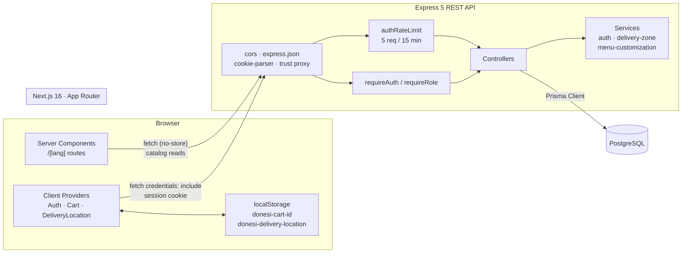
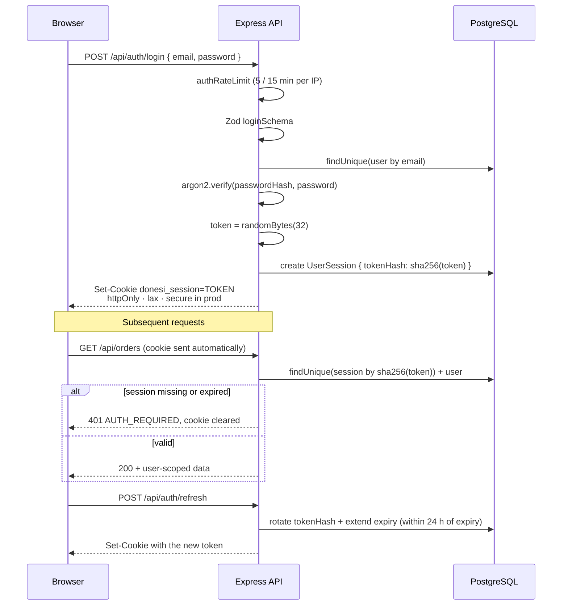

# Donesi.me

> A bilingual food-delivery web application for Podgorica, Montenegro — Next.js storefront, Express + Prisma REST API, PostgreSQL.

[](https://github.com/DaniloK77/Donesi.me/actions/workflows/ci.yml)
[](https://nextjs.org)
[](https://nodejs.org)
[](https://www.prisma.io)
[](https://www.postgresql.org)
[](LICENSE)

## Overview

Donesi.me lets customers in Podgorica browse local restaurants on a map, build a cart with
per-item customisation, pin a delivery address inside the covered zone, and place and track an
order. The whole interface ships in two locales — Montenegrin (`me`, the default) and English
(`en`) — served from JSON dictionaries rather than a translation runtime.

It is a portfolio project built end to end: a Next.js 16 App Router frontend, an Express 5 REST
API with cookie-based sessions and Argon2id password hashing, and a PostgreSQL database modelled
and migrated with Prisma.

## Screenshots

<!--
  TODO: add screenshots / GIFs here.
  Suggested captures (drop the files in docs/screenshots/ and update the paths):

  | Screen              | Route                          |
  | ------------------- | ------------------------------ |
  | Homepage + hero     | /me                            |
  | Restaurant discovery + MapLibre map | /me/restaurants |
  | Restaurant menu     | /me/restaurants/<slug>         |
  | Item customisation modal (GIF) | /me/restaurants/<slug> |
  | Cart drawer         | any page                       |
  | Delivery location picker (GIF) | any page              |
  | Special offers      | /me/special-offers             |
  | Order tracking      | /me/track-order                |

  
  
-->

_Screenshots coming soon._

## Tech Stack

| Layer          | Technology                                                                                     |
| -------------- | ---------------------------------------------------------------------------------------------- |
| **Frontend**   | Next.js 16 (App Router, Turbopack), React 19, TypeScript 5, Tailwind CSS 4, shadcn/ui + Base UI, MapLibre GL, lucide-react, Poppins via Fontsource |
| **Backend**    | Node.js, Express 5, `cors`, `cookie-parser`, `express-rate-limit`, `dotenv`, nodemon            |
| **Database**   | PostgreSQL, Prisma ORM 6 (14 committed migrations + idempotent seed)                            |
| **Auth**       | Opaque session cookie (`httpOnly`, `sameSite=lax`, `secure` in production), SHA-256 token hashes at rest, Argon2id password hashing, role-based guards |
| **Validation** | Zod 4 schemas for auth, profile, address and order payloads                                     |
| **Tooling**    | ESLint 9 (`eslint-config-next`), GitHub Actions CI, npm (backend) / Yarn (frontend)             |

## Architecture



### Authentication flow



The raw session token is never stored — only its SHA-256 hash — so a database leak alone cannot
be replayed against the API.

## Features

**Catalog & discovery**

- Restaurant listing with logos, ratings, delivery times and per-city category metadata
- Restaurant detail pages by slug with ordered menu categories, featured-item carousel and reviews
- MapLibre GL map of Podgorica restaurants, constrained to a city bounding box and a CARTO raster style
- Homepage sections: hero, deal tabs (`VEGAN` / `SUSHI` / `PIZZA_FASTFOOD` / `OTHER`), food categories, popular restaurants, app promo, partner & rider CTAs, FAQ/about tabs, stats and footer
- Weekly discounts: menu items carrying a `weeklyDiscountPercent`, grouped by restaurant with the discounted price computed server-side

**Cart & customisation**

- Server-persisted cart usable without an account — the cart id lives in `localStorage`
- Add, update quantity, remove and clear items, with a 99-per-item cap and a live subtotal
- Per-item customisation derived server-side from restaurant profiles (pizza, sushi, fast food, gyros, grill, healthy, mediterranean, breakfast), covering add-on groups with extra pricing, a cutlery toggle and a free-text special request
- Unavailable menu items are rejected at add time and again at checkout

**Delivery zone**

- Delivery-location popup with autocomplete over a seeded list of Podgorica streets
- Diacritic-insensitive street search (`Njegoševa` matches `njegoseva`)
- Bounding-box check that confirms whether a pinned coordinate falls inside the served area
- Chosen location persists in `localStorage` and syncs to the signed-in user's saved addresses

**Accounts**

- Register, log in, log out and session refresh with rotation near expiry
- Rate limiting on register, login and forgot-password
- Profile management: update name and phone, change password, delete account
- Saved delivery addresses with full CRUD and a single enforced default
- `UserRole` enum (`CUSTOMER`, `ADMIN`, `RESTAURANT_OWNER`, `COURIER`) with a `requireRole` guard available for future admin surfaces

**Orders**

- Checkout converts a cart into an order in one transaction, snapshotting item name, unit price and restaurant so later menu edits cannot rewrite order history
- `DELIVERY` and `PICKUP` types; delivery orders resolve the chosen or default address
- Order list and order detail, both scoped to the authenticated user
- Protected order-tracking page backed by the `OrderStatus` lifecycle (`PENDING` → `CONFIRMED` → `PREPARING` → `OUT_FOR_DELIVERY` → `DELIVERED` / `CANCELLED`)

**Internationalisation**

- `me` and `en` locales under `/[lang]`, statically generated with `dynamicParams = false`; `/` redirects to `/me`
- Per-page JSON dictionaries, typed and loaded server-side

> Not yet implemented: password reset and email verification return `501`, and forgot-password
> responds `202` without sending mail. Order status is not advanced by any worker or admin endpoint
> — orders stay `PENDING` after creation.

## Getting Started

### Prerequisites

- Node.js 22 (or 20+)
- npm (backend) and Yarn 1.x (frontend)
- A PostgreSQL 14+ database

### 1. Clone

```bash
git clone https://github.com/DaniloK77/Donesi.me.git
```

```bash
cd Donesi.me
```

### 2. Backend

```bash
cd backend
```

```bash
cp .env.example .env
```

Edit `.env` and point `DATABASE_URL` at your PostgreSQL instance. `PORT` defaults to `5001` and
`FRONTEND_URL` must match the frontend origin exactly — CORS runs with `credentials: true`, which
forbids a wildcard.

```bash
npm install
```

Apply the committed migrations and load the development dataset (seed is idempotent — restaurants,
menus, Podgorica streets, deals, categories and reviews):

```bash
npx prisma migrate deploy
```

```bash
npm run db:seed
```

Start the API on `http://localhost:5001`:

```bash
npm run dev
```

Check it is up:

```bash
curl http://localhost:5001/health
```

### 3. Frontend

From the repository root, in a second terminal:

```bash
cd frontend
```

```bash
cp .env.example .env.local
```

The default `NEXT_PUBLIC_API_URL=http://localhost:5001` matches the backend defaults, so no edit is
needed for local work.

```bash
yarn install
```

```bash
yarn dev
```

Open [http://localhost:3000](http://localhost:3000) — it redirects to `/me`.

### Useful scripts

| Location   | Command           | Description                                     |
| ---------- | ----------------- | ----------------------------------------------- |
| `backend`  | `npm run dev`     | Start the API with nodemon                      |
| `backend`  | `npm start`       | Start the API with plain node                   |
| `backend`  | `npm run db:seed` | Run the idempotent Prisma seed                  |
| `frontend` | `yarn dev`        | Next.js dev server                              |
| `frontend` | `yarn build`      | Production build                                |
| `frontend` | `yarn start`      | Serve the production build                      |
| `frontend` | `yarn lint`       | ESLint                                          |

## API Reference

Base URL: `http://localhost:5001`. Authenticated routes read the `donesi_session` cookie, so
browser calls must use `credentials: "include"`.

### Health

| Method | Endpoint  | Description                | Auth |
| ------ | --------- | -------------------------- | ---- |
| `GET`  | `/health` | Liveness probe, `{ status }` | –  |

### Authentication — `/api/auth`

| Method | Endpoint                     | Description                                             | Auth |
| ------ | ---------------------------- | ------------------------------------------------------- | ---- |
| `POST` | `/api/auth/register`         | Create an account and open a session · rate limited      | –    |
| `POST` | `/api/auth/login`            | Authenticate and open a session · rate limited           | –    |
| `POST` | `/api/auth/logout`           | Destroy the session and clear the cookie                 | –    |
| `GET`  | `/api/auth/me`               | Current user                                             | ✅   |
| `POST` | `/api/auth/refresh`          | Rotate the session token when close to expiry            | ✅   |
| `POST` | `/api/auth/forgot-password`  | Placeholder — always `202`, no mail sent · rate limited  | –    |
| `POST` | `/api/auth/reset-password`   | Not implemented (`501`)                                  | –    |
| `POST` | `/api/auth/verify-email`     | Not implemented (`501`)                                  | –    |

### Users — `/api/users`

| Method   | Endpoint                 | Description                          | Auth |
| -------- | ------------------------ | ------------------------------------ | ---- |
| `PATCH`  | `/api/users/me`          | Update name and/or phone             | ✅   |
| `PATCH`  | `/api/users/me/password` | Change password (verifies the old one) | ✅ |
| `DELETE` | `/api/users/me`          | Delete the account and its data       | ✅   |

### Addresses — `/api/addresses`

| Method   | Endpoint              | Description                                  | Auth |
| -------- | --------------------- | -------------------------------------------- | ---- |
| `GET`    | `/api/addresses`      | List the user's addresses, default first     | ✅   |
| `POST`   | `/api/addresses`      | Create an address, optionally as the default | ✅   |
| `PATCH`  | `/api/addresses/:id`  | Update an address                             | ✅   |
| `DELETE` | `/api/addresses/:id`  | Delete an address                             | ✅   |

### Restaurants & catalog

| Method | Endpoint                     | Description                                                    | Auth |
| ------ | ---------------------------- | -------------------------------------------------------------- | ---- |
| `GET`  | `/api/restaurants`           | Restaurant summaries ordered by `displayOrder`                 | –    |
| `GET`  | `/api/restaurants/:slug`     | One restaurant with reviews, menu categories, items, featured items and customisation definitions | – |
| `GET`  | `/api/popular-restaurants`   | Top six restaurants for the homepage                            | –    |
| `GET`  | `/api/categories`            | Food categories in a fixed display order                        | –    |
| `GET`  | `/api/deals`                 | Promo deals · optional `?category=VEGAN\|SUSHI\|PIZZA_FASTFOOD\|OTHER` | – |
| `GET`  | `/api/deals/weekly`          | Discounted menu items grouped by restaurant                     | –    |
| `GET`  | `/api/streets`               | Podgorica streets · optional `?query=` diacritic-insensitive search | – |

### Delivery — `/api/delivery`

| Method | Endpoint                       | Description                                          | Auth |
| ------ | ------------------------------ | ---------------------------------------------------- | ---- |
| `POST` | `/api/delivery/check-location` | Validate an address and test coordinates against the Podgorica zone | – |

### Cart — `/api/cart`

Carts are addressed by an unguessable `cartId`, so they work for guests; no session is required.

| Method   | Endpoint                                   | Description                                    | Auth |
| -------- | ------------------------------------------ | ---------------------------------------------- | ---- |
| `POST`   | `/api/cart`                                | Create an empty cart                            | –    |
| `GET`    | `/api/cart/:cartId`                        | Cart with items, quantities and subtotal        | –    |
| `POST`   | `/api/cart/:cartId/items`                  | Add an item with quantity and customisation     | –    |
| `PATCH`  | `/api/cart/:cartId/items/:menuItemId`      | Set an item's quantity (1–99)                   | –    |
| `DELETE` | `/api/cart/:cartId/items/:menuItemId`      | Remove one item                                 | –    |
| `DELETE` | `/api/cart/:cartId/items`                  | Empty the cart                                  | –    |

### Orders — `/api/orders`

| Method | Endpoint          | Description                                                | Auth |
| ------ | ----------------- | ---------------------------------------------------------- | ---- |
| `POST` | `/api/orders`     | Turn a cart into an order (`DELIVERY` or `PICKUP`) and empty the cart | ✅ |
| `GET`  | `/api/orders`     | The user's orders, newest first                             | ✅   |
| `GET`  | `/api/orders/:id` | One order, scoped to the owner                              | ✅   |

### Error format

Errors share one envelope; validation failures add a per-field map.

```json
{
  "code": "VALIDATION_ERROR",
  "error": "The submitted data is invalid.",
  "fields": { "email": ["Invalid email"] }
}
```

Common codes: `AUTH_REQUIRED`, `FORBIDDEN`, `INVALID_CREDENTIALS`, `EMAIL_ALREADY_EXISTS`,
`AUTH_RATE_LIMITED`, `CART_NOT_FOUND`, `MENU_ITEM_UNAVAILABLE`, `MAX_QUANTITY_EXCEEDED`,
`EMPTY_CART`, `ADDRESS_REQUIRED`, `ORDER_NOT_FOUND`, `NOT_FOUND`, `INTERNAL_ERROR`.

## Project Structure

```
Donesi.me/
├── .github/workflows/ci.yml     # Lint + build pipeline for both apps
├── backend/                     # Express 5 REST API (CommonJS)
│   ├── prisma/
│   │   ├── migrations/          # 14 committed SQL migrations
│   │   ├── schema.prisma        # Data model: users, restaurants, menus, carts, orders
│   │   └── seed.js              # Idempotent dev dataset (restaurants, menus, streets, deals)
│   ├── src/
│   │   ├── config/              # env loading and the shared PrismaClient
│   │   ├── controllers/         # Request handlers, one module per resource
│   │   ├── middleware/          # requireAuth / requireRole, auth rate limiter
│   │   ├── routes/              # Express routers mounted in index.js
│   │   ├── services/            # auth sessions, delivery zone, menu customisation
│   │   ├── utils/               # small helpers (diacritic stripping)
│   │   ├── validation/          # Zod schemas per resource
│   │   └── index.js             # App wiring, CORS, 404 and error handlers
│   ├── prisma.config.ts         # Prisma CLI config (schema, migrations, seed)
│   └── .env.example
└── frontend/                    # Next.js 16 App Router storefront (TypeScript)
    ├── public/                  # Static images, brand assets and icons
    ├── src/
    │   ├── app/
    │   │   ├── [lang]/          # Locale-scoped routes: home, restaurants, restaurants/[slug],
    │   │   │                    # special-offers, track-order, login, register, profile
    │   │   ├── layout.tsx       # Auth → DeliveryLocation → Cart provider tree
    │   │   └── page.tsx         # Redirects / → /me
    │   ├── components/
    │   │   ├── auth/            # AuthProvider, AuthForm, ProfilePanel, ProtectedRoute
    │   │   ├── cart/            # CartProvider and CartDrawer
    │   │   ├── delivery/        # Location provider, picker and popup
    │   │   ├── orders/          # Order API client and TrackOrderPanel
    │   │   ├── sections/        # Page sections: homepage, restaurantpage,
    │   │   │                    # restaurantmenu, specialoffers
    │   │   └── ui/              # Shared primitives (MapLibre map wrapper)
    │   ├── data/pagesTextData/  # me/ and en/ JSON dictionaries per page
    │   ├── lib/                 # Map configuration and class-name helpers
    │   └── utils/               # Typed dictionary loaders and small helpers
    ├── components.json          # shadcn/ui configuration
    └── .env.example
```

## Continuous Integration

[`.github/workflows/ci.yml`](.github/workflows/ci.yml) runs on every push and pull request to
`main`, in two parallel jobs:

- **Backend** — `npm ci`, `prisma validate`, `prisma generate`, and a `node --check` syntax pass
  over `src/` and `prisma/`. No database is contacted.
- **Frontend** — `yarn install --frozen-lockfile`, `yarn lint`, `yarn build`.

The backend has no lint or test script yet, so the pipeline verifies what the current toolchain
actually can — adding Jest or Vitest coverage is the natural next step.

## License

Released under the [MIT License](LICENSE).
